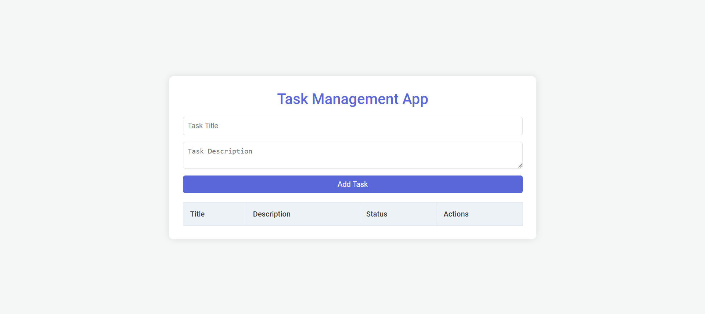
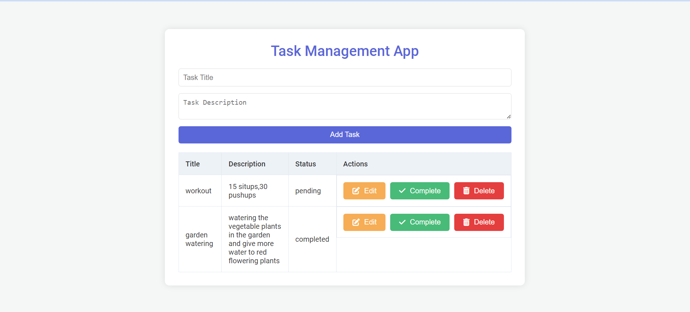
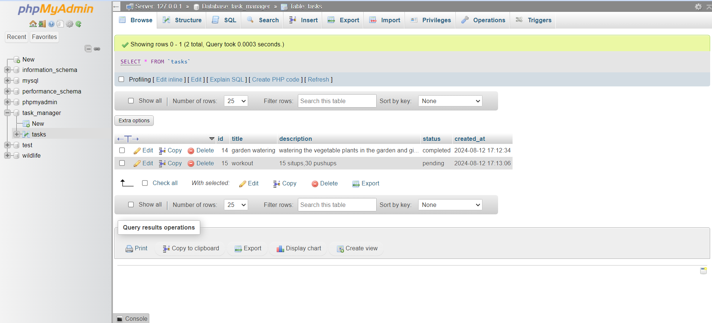

# Task Management App

A simple and modern task management application that allows users to add, edit, complete, and delete tasks. The app provides a responsive design and professional styling, ensuring a user-friendly interface.

## Features

- **Add Tasks**: Easily add new tasks with titles and descriptions.
- **Edit Tasks**: Update task details with a simple edit interface.
- **Complete Tasks**: Mark tasks as complete.
- **Delete Tasks**: Remove tasks from the list.
- **Professional Styling**: Modern and intuitive UI with Font Awesome icons.

## Technologies Used

- **Frontend**: HTML, CSS, JavaScript
- **Backend**: PHP
- **Database**: MySQL
- **Libraries/Frameworks**: Font Awesome for icons

## Installation

### Prerequisites

- PHP and MySQL installed on your local machine or server.
- Web server like Apache.

### Setup

1. **Clone the Repository**

   ```bash
   git clone <repository-url>
   cd <repository-folder>

 ## Screenshot of the website
 
 
  

 
